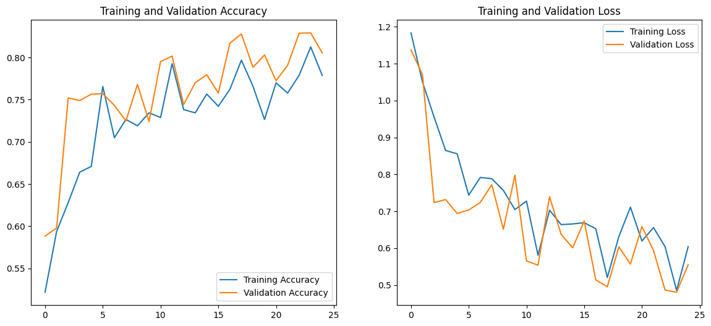

# CNN 모델 튜닝을 통한 이미지 분류 성능 비교 분석

## 1. 프로젝트 개요

- **목표**: CNN(합성곱 신경망) 모델의 구조 및 하이퍼파라미터 변경이 이미지 분류 성능에 미치는 영향을 비교 분석하고, 이를 통해 최적화된 모델을 도출한다.
- **데이터셋**: Intel Image Classification (6 Classes)
- **개발 환경**: Google Colab (T4 GPU), TensorFlow, Keras

---

## 2. 실험 설계

모든 실험은 일관된 비교를 위해 이미지 크기 `(100, 100)`, 에포크 `10`으로 통일하여 진행했다.

- **기준 모델 (Baseline Model)**
  - **구조**: 3개의 합성곱 층과 `Dropout(0.5)`를 적용한 표준 CNN 모델.
  - **설정**: `learning_rate=0.001`, `dropout_rate=0.5`.

- **실험 1: 더 깊은 모델 (Deeper Model)**
  - **변경점**: 기준 모델에 합성곱 층(Conv2D+MaxPooling2D) 한 세트를 추가.
  - **가설**: 모델의 표현 능력(capacity) 증가가 성능 향상으로 이어질 것이다.

- **실험 2: 학습률 변경 모델 (Lower LR Model)**
  - **변경점**: `learning_rate`를 `0.001`에서 `0.0001`로 감소.
  - **가설**: 낮은 학습률이 더 안정적인 수렴과 높은 최종 성능을 유도할 것이다.

- **실험 3: 드롭아웃 비율 조정 모델 (Increased Dropout Model)**
  - **변경점**: `Dropout` 비율을 `0.5`에서 `0.7`로 증가.
  - **가설**: 강화된 규제(regularization)가 과적합을 억제하여 일반화 성능을 개선할 것이다.

---

## 3. 실험 결과 요약

| 모델 구분 | 변경점 | 최종 검증 정확도 | 최고 검증 정확도 | 최종 검증 손실 |
| :--- | :--- | :--- | :--- | :--- |
| **기준 모델** | - | 77.4% | 77.5% | 0.6124 |
| **실험 1: 더 깊은 모델** | Conv 층 추가 | 74.4% | 78.4% | 0.6937 |
| **실험 2: 학습률 변경** | `lr=0.0001` | 66.3% | 69.9% | 0.9521 |
| **실험 3: 드롭아웃 변경**| `dropout=0.7` | 77.4% | **78.6%** | 0.6293 |
| **최종 모델** | `dropout=0.7`, `epochs=25` | **80.6%** | **82.9%** | 0.5561 |

---

## 4. 결과 분석

- **더 깊은 모델**: 모델 복잡도 증가는 제한된 학습 환경에서 오히려 성능 저하를 야기했다. 이는 깊어진 모델의 파라미터를 최적화하기에 10 에포크가 충분하지 않았고, 과적합이 더 쉽게 발생했기 때문으로 분석된다.

- **학습률 변경 모델**: 가장 낮은 성능을 기록했다. 이는 학습 속도가 현저히 느려져 10 에포크 내에 충분한 학습이 이루어지지 않았음을 의미한다. 안정적인 수렴을 위해서는 더 많은 학습 시간이 필요함을 시사한다.

- **드롭아웃 비율 조정 모델**: 기준 모델과 동일한 최종 정확도를 기록했으나, 학습 과정 중 가장 높은 최고 정확도(78.6%)를 달성했다. 이는 강화된 규제가 과적합을 효과적으로 억제하여 더 나은 성능 지점을 탐색할 잠재력이 있음을 의미한다.

---

## 5. 최종 모델 및 결론

#### 5.1. 최종 모델 학습
실험 결과 가장 높은 잠재력을 보인 '드롭아웃 비율 조정 모델'을 기반으로, 에포크 수를 25로 늘려 추가 학습을 진행했다.

*(참고: 보고서에 이미지를 포함시키려면, GitHub 저장소에 이미지를 업로드한 뒤 그 이미지의 주소를 복사하여 위와 같이 넣어주면 됩니다.)*

최종 모델은 검증 데이터에 대해 **최고 82.9%**, **최종 80.6%**의 정확도를 달성하여, 기준 모델 대비 약 **3.2%p**의 유의미한 성능 향상을 확인했다.

#### 5.2. 결론
실험 결과, 모델의 복잡도를 높이는 것보다 과적합을 효과적으로 제어하는 것이 성능 향상에 더 큰 영향을 미쳤다. 따라서 이 문제에서는 **적절한 규제(Regularization) 적용이 가장 효과적인 모델 개선 전략**이라 결론 내릴 수 있다.
